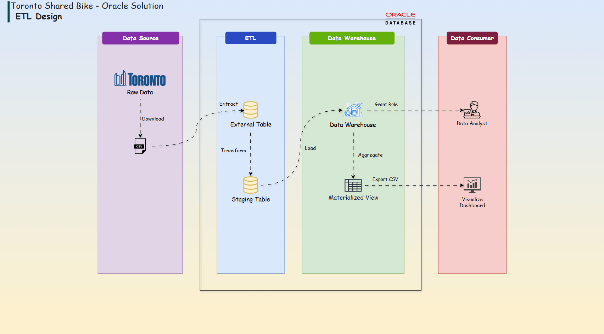
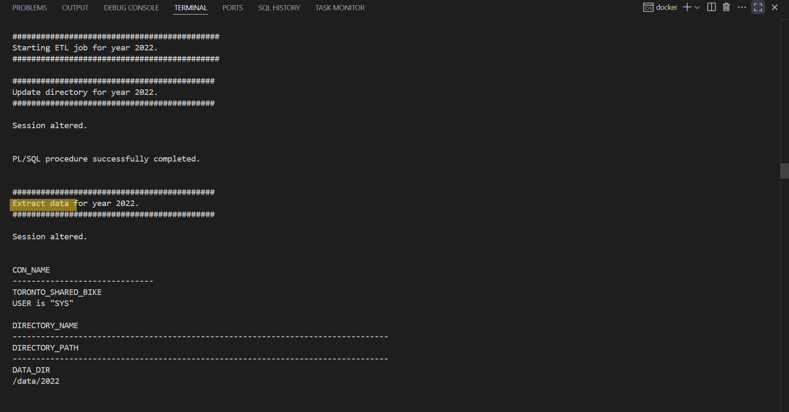
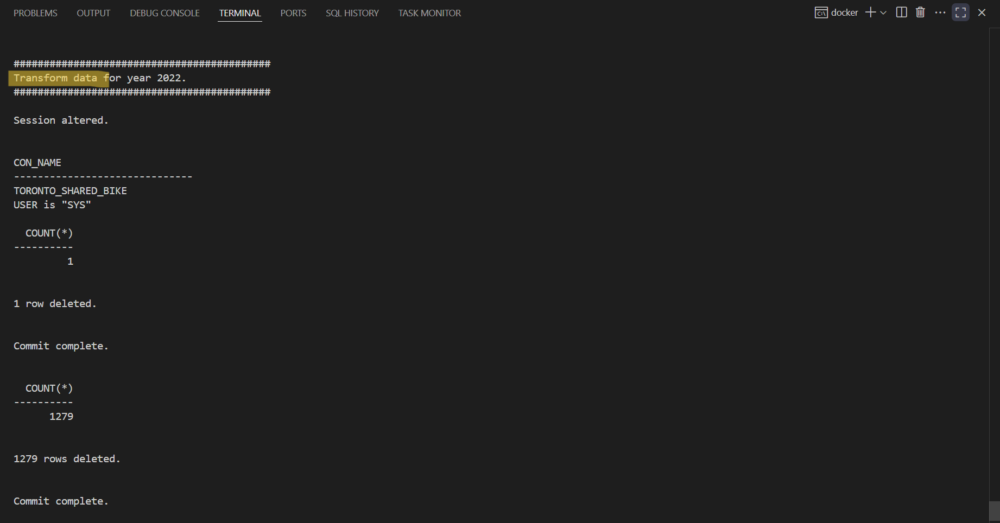
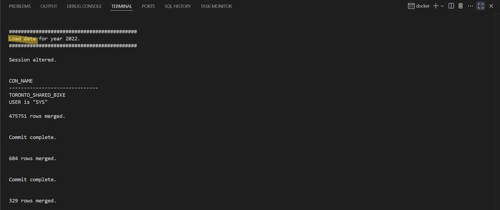
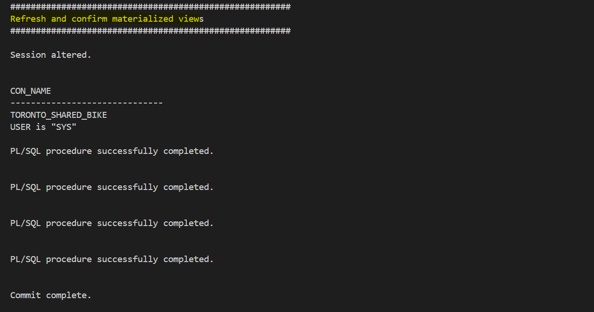
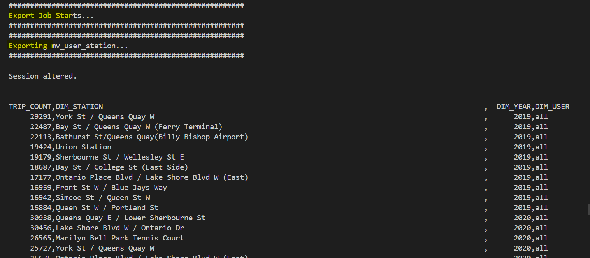

# Toronto Shared Bike Data Warehouse Project - Oracle Datbase Solution

A data warehouse project of Toronto Shared Bike using Oracle database.

- [Toronto Shared Bike Data Warehouse Project - Oracle Datbase Solution](#toronto-shared-bike-data-warehouse-project---oracle-datbase-solution)
  - [Data Warehouse](#data-warehouse)
    - [Logical Design](#logical-design)
    - [Physical Implementation](#physical-implementation)
    - [Connect with Oracle](#connect-with-oracle)
  - [ETL Pipeline](#etl-pipeline)

---

## Data Warehouse

- Data Source:
  - https://open.toronto.ca/dataset/bike-share-toronto-ridership-data/

### Logical Design


---

### Physical Implementation

- Initialize Oracle Database

```sh
cd oracle19c
docker compose up -d
```

---

### Connect with Oracle

- Connection


---

## ETL Pipeline

- Diagram



- Batch job: ETL

```sh
docker exec -it oracle19cDB bash /opt/oracle/scripts/etl/multiple_year_etl_job.sh 2019 2022
```







- Refresh Materialized view

```sh
docker exec -it oracle19cDB bash /opt/oracle/scripts/mv/mv_refresh.sh
```



- Export MV

```sh
docker exec -it oracle19cDB bash /opt/oracle/scripts/export/export.sh
```


